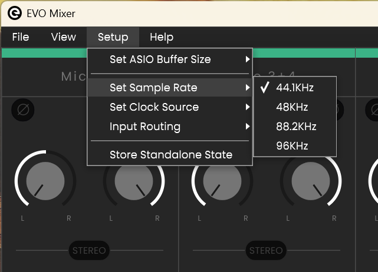

# 🎛️ EVO-16 Setup Guide

---

## 💽 Step 1: Install the Driver
Download and install the latest EVO-16 driver from [**Audient**](https://audient.com/products/audio-interfaces/evo-16/downloads/).  
Supports **Windows** and **macOS**.

---

## 🔌 Step 2: Make the Connection
If using an **EVO-SP8**, connect it to the **EVO-16** using **optical cables only** (highlighted in green):  

---

## 🎚️ Step 3: Match the Sample Rate (SR)
When connecting **EVO-16** and **EVO-SP8**, both devices must run at the **same sample rate**.  

⚠️ The setup process differs:  
- On **EVO-16**, the SR is set from your **computer**.  
- On **EVO-SP8**, the SR is set directly on the **device**.

---

### 🖥️ Step 3.1: Set SR on EVO-16
#### macOS
1. Open **Audio MIDI Setup** from Launchpad.  
     
2. Select **EVO-16** and set the sample rate to **44,100 Hz**.  
   

#### Windows
1. Open **EVO Mixer**.  
2. Go to **Set Sample Rate → 44.1 kHz**.  
   

---

### 🎛️ Step 3.2: Set SR on EVO-SP8
1. On the **EVO-SP8**, press the **main knob**.  
2. Navigate to **Sample Rate** and select **44.1 kHz**.

---

### ✅ Step 3.3: Confirm SR Consistency
On both devices, open **Status** (via the main knob).  
Each display should show **44.1 kHz**.  

