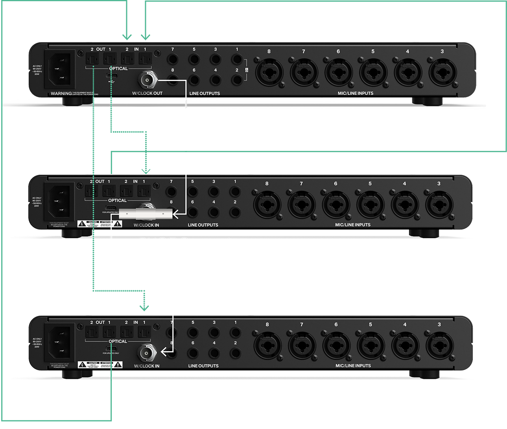
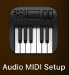
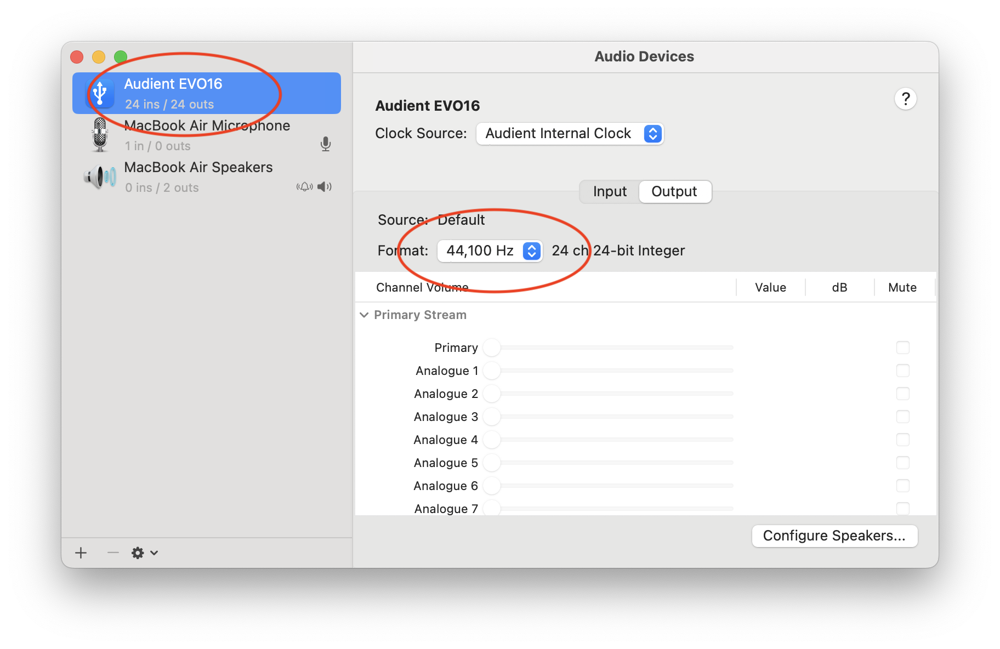
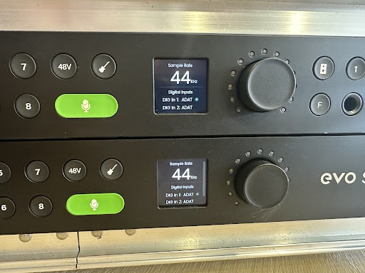
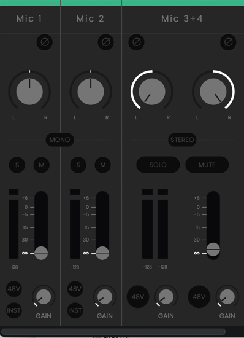
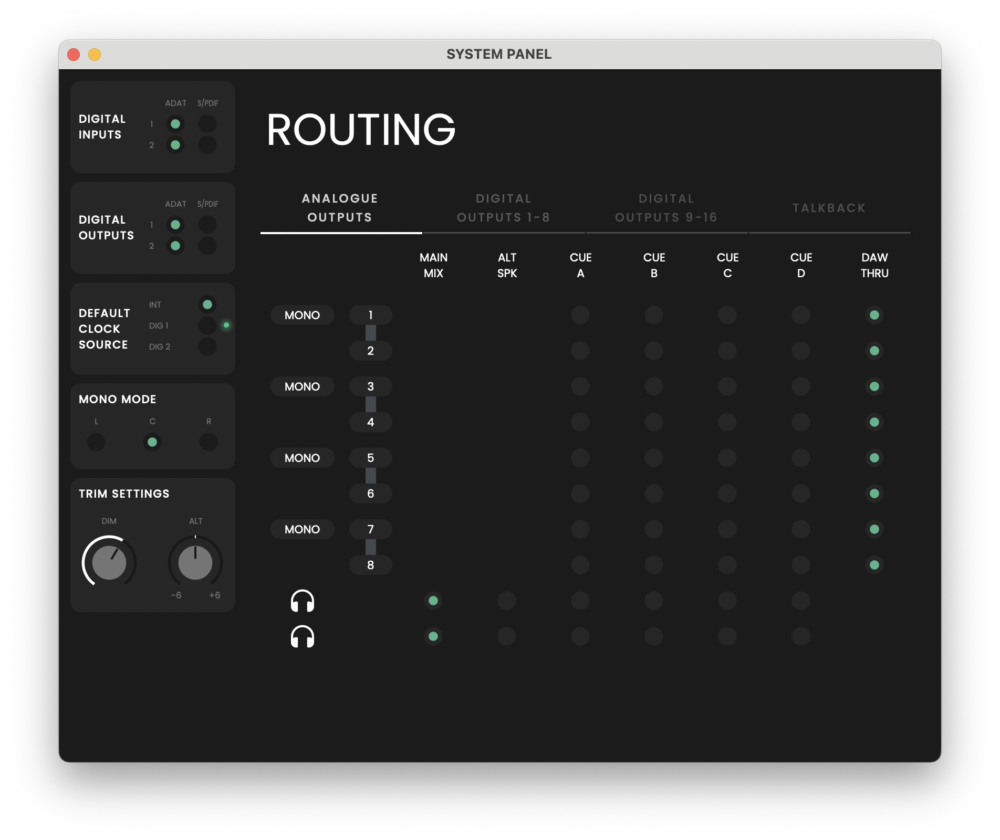

# 🎛️ EVO-16 Setup

> 📌 Follow these instructions **only** if you are using **EVO-16 together with EVO-SP8**.  
> 📌 If you're using **EVO-16 alone**, you can skip this guide.

---

## 🔌 Connection

Connect the **EVO-16** to the **EVO-SP8** using **optical cables only** (highlighted in green):

---

## 🎚️ Consistent Sampling Rate (SR)

When EVO-16 and EVO-SP8 are connected, both devices must operate at the **same sampling rate (SR)**.  
⚠️ The setup method differs between the two devices.

---

### 🖥️ Set SR on EVO-16 (macOS Only)

1. Open **Audio MIDI Setup** from Launchpad:

   

2. Select **EVO-16**, then set the sample rate to **44,100 Hz**:

   

---

### 🎛️ Set SR on EVO-SP8

1. On the **EVO-SP8** hardware, press the main knob.
2. Navigate to **Sample Rate** and set it to **44.1 kHz**.

---

### ✅ Verify SR Consistency

On both devices, go to **Status** via the main knob.  
You should see **44 kHz** displayed on each of their small screens.

---

## 🎙️ Mono Routing

Ensure input channels are configured for **mono**, not stereo pairing.

In the image below:

- ✅ Channels 1 & 2 are **MONO** — correct
- ❌ Channels 3 & 4 are **STEREO** — incorrect  
  👉 Click **STEREO** between them to decouple

Additionally, go to `View → Show System Panel` and decouple all channels:

